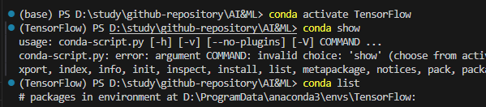

## conda 

### 项目启动流程

**1.创建虚拟环境**

```bash
conda create -n TensorFlow python=3.6
# -n TensorFlow指定环境名称为TensorFlow
# python=3.6指定python版本
```

**2.激活虚拟环境**

创建环境之后，激活使用
```bash
conda activate TensorFlow
```
激活后，会显示当前环境名称


使用conda list查看当前环境安装的包（没有conda show，不要看上图）
**3.安装项目依赖**

在激活的项目中安装项目所需的包，使用conda install
```bash
conda install numpy pandas matplotlib
```
对于conda仓库中没有或者版本比较旧的包，可以使用pip install。

一般的实践是手动创建并手写一个requirements.txt如下
```txt
numpy==1.21.0
pandas==1.3.0
requests==2.26.0
```
然后使用如下命令安装
```bash
pip install -r requirements.txt
```

**4.导出环境配置（可选）**

使用conda env export导入
```bash
conda env export > environment.yml
```
生成的environment.yml记录了所有已安装包的确切版本，可以通过以下命令基于该文件创建环境
```bash 
conda env create -f environment.yml
```

确定是在正确的环境下编写、运行和调试代码即可

### 常见的conda命令

#### 查看当前环境安装的python包
```bash
conda list
# -n [环境名]   可选，查看某个环境名的包
```